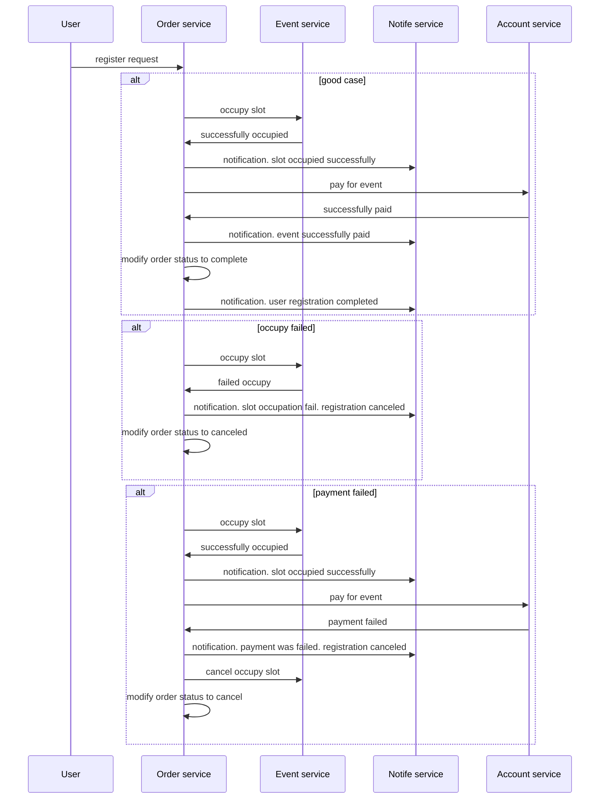

# otus-proj


приложения деплоятся в пространство proj
Установка:
```

minikube config set-context --current --namespace=proj
git clone https://github.com/xost/otus-proj.git

cd otus-proj

helm repo add jaeger-all-in-one https://raw.githubusercontent.com/hansehe/jaeger-all-in-one/master/helm/charts
helm install jaeger-all-in-one jaeger-all-in-one/jaeger-all-in-one

kubectl apply -f jaeger/jaeger-all-in-one.yaml
kubecl replace -f jaeger/configmap.yaml

make install
```
Авторизуемся:
```
cookie=$(curl -c - -X POST http://arch.homework/login -d '{"login":"admin","password":"password"}')
```
Пополним баланс (операции идемподентны):
```
$curl -v --cookie <(echo "$cookie") -X GET http://arch.homework/account/genreq
$curl --cookie <(echo "$cookie") --header "X-Request-Id: 9ec992778cea45cc4db54bc479e673d5" -X POST http://arch.homework/account/deposit -d '{"delta":100}
$curl --cookie <(echo "$cookie") -X GET http://arch.homework/account/get
```
баланс изменился:
```
{"balance":100}
```
Cоздадим несколько мероприятий:
```
$curl --cookie <(echo "$cookie") -X POST http://arch.homework/events/create -d '{"event_name":"red run", "total_slots":2, "price":30}'
{"created_status": true, "event_id": 47, "event_name": red run, "price": 30, "total_slots": 2}

$curl --cookie <(echo "$cookie") -X POST http://arch.homework/events/create -d '{"event_name":"green run", "total_slots":5, "price":50}'
{"created_status": true, "event_id": 48, "event_name": green run, "price": 50, "total_slots": 5}
```
Зарегистрируемся на мероприятие:
```
$curl --cookie <(echo "$cookie") -X POST http://arch.homework/orders/create -d '{"event_id":47}'
{"success":true, "order_id":11}
```
проверим статус регистрации (статус 4 - прошла успешно):
```
$curl --cookie <(echo "$cookie") -X GET http://arch.homework/orders/get/11
{
	"id": 11,
	"user_id": 1,
	"event_id": 47,
	"price": 30,
	"status": 4
}
```
проверим баланс (уменьшился на стоимость мероприятия):
```
$curl --cookie <(echo "$cookie") -X GET http://arch.homework/account/get
{"balance":70}
```
должны получить оповещение (отправка на почту не реализована):
```
$curl --cookie <(echo "$cookie") -X GET http://arch.homework/notif/get/11
{
	"order_id": 11,
	"message": "Order was successfully completed"
}

```
Повторим регистрацию на мероприятие:
```
$curl --cookie <(echo "$cookie") -X POST http://arch.homework/orders/create -d '{"event_id":47}'
{"success":true, "order_id":12}
```
проверим статус регистрации (статус 4 - прошла успешно):
```
$curl --cookie <(echo "$cookie") -X GET http://arch.homework/orders/get/12
{
	"id": 12,
	"user_id": 1,
	"event_id": 47,
	"price": 30,
	"status": 4
}
```
проверим баланс (уменьшился на стоимость мероприятия):
```
$curl --cookie <(echo "$cookie") -X GET http://arch.homework/account/get
{"balance":40}
```
Повторим регистрацию на мероприятие третий раз (максимальное возможное количество на это мероприятие слотов - 2 ):
```
$curl --cookie <(echo "$cookie") -X POST http://arch.homework/orders/create -d '{"event_id":47}'
{"success":true, "order_id":13}
```
проверим статус регистрации (статус -1 - отмена регистрации т.к. не осталось доступных слотов):
```
$curl --cookie <(echo "$cookie") -X GET http://arch.homework/orders/get/13
{
	"id": 13,
	"user_id": 1,
	"event_id": 47,
	"price": 30,
	"status": -1
}
```
проверим баланс (не изменился):
```
$curl --cookie <(echo "$cookie") -X GET http://arch.homework/account/get
{"balance":40}
```
Попробуем зарегистрироваться на другое мероприятие (стоимость участия - 50):
```
$curl --cookie <(echo "$cookie") -X POST http://arch.homework/orders/create -d '{"event_id":48}'
{"success":true, "order_id":14}
```
проверим статус регистрации (статус -1 - отмена регистрации т.к. не хватает денег на балансе):
```
$curl --cookie <(echo "$cookie") -X GET http://arch.homework/orders/get/14
{
	"id": 14,
	"user_id": 1,
	"event_id": 48,
	"price": 50,
	"status": -1
}
```




Посмотрим на трассировку операций:


